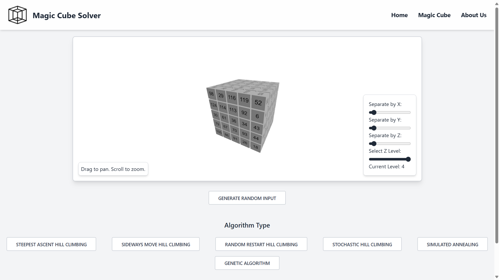

# Tugas Besar 1 IF3170 Inteligensi Artifisial 2024/2025

> Disusun untuk memenuhi tugas mata kuliah Inteligensi Artifisial untuk Semester 5 tahun ajaran 2024 / 2025



## Daftar Isi
-   [Deskripsi Program](#deskripsi-program)
-   [Daftar Persyaratan](#daftar-persyaratan)
-   [Cara Menjalankan Aplikasi](#cara-menjalankan-aplikasi)
-   [Status Proyek](#status-proyek)
-   [Pembagian Kerja Kelompok](#pembagian-kerja-kelompok)


## Deskripsi Program
Program pencarian solusi **Diagonal Magic Cube** berukuran 5x5x5 ini dirancang untuk mengimplementasikan tiga algoritma pencarian lokal, yaitu Hill Climbing, Simulated Annealing, dan Genetic Algorithm. Pengguna dapat melakukan eksperimen dengan menjalankan setiap algoritma beberapa kali, mengamati perubahan nilai **objective function**, durasi proses, dan konsistensi hasil pencarian. Program ini juga menyediakan visualisasi dari kondisi awal dan akhir kubus, memudahkan pengguna untuk memantau perkembangan solusi dalam tiap iterasi. Dengan pendekatan ini, aplikasi bertujuan untuk memberikan pemahaman mendalam tentang performa algoritma pencarian lokal dalam menyelesaikan permasalahan kompleks.

## Daftar Persyaratan

- [Golang](https://go.dev/doc/install)
- [Node Package Manager](https://nodejs.org/en/download/package-manager)

## Cara Menjalankan Aplikasi

1. Buka terminal dan clone repositori ini

```
git clone https://github.com/Nerggg/MagicCube-LocalSearch
```

2. Buka terminal dan navigasi ke direktori src lalu navigasi ke direktori frontend aplikasi

```
cd MagicCube-LocalSearch/src/frontend/
```

3. Install dependencies dari aplikasi

```
npm install
```

4. Jalankan frontend dari aplikasi

```
npm run dev
```

5. Buka terminal lain dan navigasi ke direktori src lalu navigasi ke direktori backend aplikasi

```
cd MagicCube-LocalSearch/src/backend/
```

6. Jalankan backend dari aplikasi

```
go run .
```

7. Buka aplikasi di laman [localhost:3000](https://localhost:3000)

## Status Proyek
_Completed_


## Pembagian Kerja Kelompok

| Fitur                         | Kontributor                                    |
| ----------------------------- | ---------------------------------------------- |
| Frontend                      | [13522124](https://github.com/alandmprtma)     |
| Hill Climbing Algorithm       | [13522147](https://github.com/Nerggg)          |
| Simulated Annealing Algorithm and Backend Integration | [13522126](https://github.com/rizqikapratamaa) |
| Genetic Algorithm             | [13522135](https://github.com/ChrisCS50X)      |
